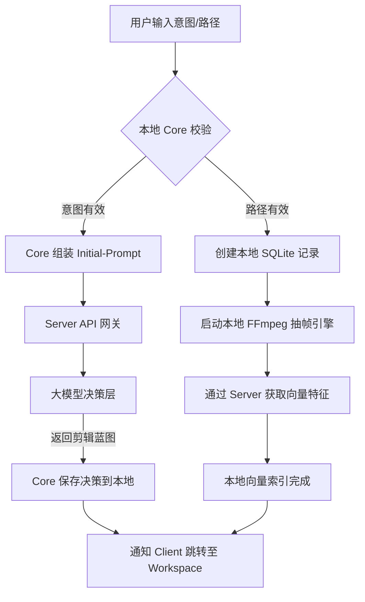

**启动台（Launchpad）**不再只是一个简单的文件列表，它实际上是 **EntroCut 系统的“网关”与“项目初始化器”**。

它负责协调本地文件系统的“物理感知”与云端 AI 的“逻辑预热”。以下是详细的功能设计与流程解析：

---

### 一、 启动台的三端职责细分

| 功能模块 | Client (React/Electron) | Core (本地 Python) | Server (云端中转) |
| --- | --- | --- | --- |
| **项目列表加载** | 渲染卡片，监听本地项目数据库变化 | 查询 SQLite，读取本地 `projects/` 目录下的元数据 | 返回该用户在云端备份的项目元信息（同步状态） |
| **文件夹扫描** | 唤起原生文件夹选择窗口，获取绝对路径 | **[重活]** 递归遍历文件，提取编码信息、分辨率、时长 | 记录该文件夹的哈希值，防止重复索引 |
| **提示词工程** | 捕获意图（如“帮我剪一个极限运动片”） | **[核心]** 组装“初始化 Prompt”，向 Server 请求初步剪辑建议 | 转发 Prompt 给大模型，返回“初期镜头筛选策略” |
| **环境自检** | 显示 Core/Server 连接状态灯 | 检查 FFmpeg 是否可用，检查 GPU 驱动状态 | 校验 API Key 有效期及模型额度 |

---

### 二、 核心功能全流程解析

#### 1. 场景一：基于“文件夹”创建（传统导入流）

这是用户已有素材，需要 AI 介入分析的场景。

* **Step 1 (Client)**: 用户点击“浏览目录”，Electron 弹出选择器，获取路径 `D:/Vlog/Japan_Trip`。
* **Step 2 (Core)**: 接收路径，在本地数据库创建项目记录。启动后台 Workers 开始“洗数”：
* FFmpeg 抽帧。
* 通过 Server 中转调用阿里云 Embedding。
* **Step 3 (Client)**: 直接进入工作台，asset的缩略图上显示“处理中...”进度条的。同时对话框中提示正在对上传的视频进行向量化处理。此时AI可以进行对话，来获取更多用户对最终视频的预期，为后续上下文工程提供参考，但是在所有素材向量化完成之前不能进行对话。
* **Step 4 (Core)**: 向量化完成后，通知 Client。此时AI 已经对素材“了如指掌”。

#### 2. 场景二：基于“意图 + 素材”创建（AI 驱动流）

这是 EntroCut 的核心卖点。用户在输入框写下：“帮我剪一段日本滑雪的集锦”，并拖入文件夹。

* **Step 1 (Client)**: 同时将 Prompt 和路径发送给 Core。
* **Step 2 (Core - Brain)**:
* **先行决策**：Core 立即把 Prompt 发给 Server 换取大模型的“第一反应”。同时对话框中提示正在对上传的视频进行向量化处理。此时AI可以进行对话，来获取更多用户对最终视频的预期，为后续上下文工程提供参考，但是在所有素材向量化完成之前不能进行对话。
* **Server 返回**：“建议寻找带有雪花飞溅、雪道全景、缆车视角的镜头。”
* **Step 3 (Core - Action)**: Core 开始扫描素材，并**优先**对符合关键词的镜头进行向量化和特征提取。
* **Step 4 (Jump)**: Client 自动跳转到工作台，此时 AI 已经在聊天框主动说：“我已经扫描了你的文件夹，并初步锁定了 12 个滑雪精彩镜头，正在生成分镜...”

---

### 三、 详细逻辑流程图 (Launchpad Logic)



---

### 四、 启动台状态管理设计 (Zustand)

为了实现上述流程，`useLaunchpadStore` 需要管理以下状态：

```typescript
interface LaunchpadStore {
  // 状态
  projects: ProjectMeta[]; // 包含 ID, 标题, 封面图, 处理进度(%)
  systemStatus: 'connecting' | 'ready' | 'error'; // Core 是否在线
  isProcessing: boolean; // 是否有后台任务在跑向量化

  // 动作
  scanLocalDirectory: (path: string) => Promise<void>;
  createProjectWithPrompt: (prompt: string, path?: string) => Promise<string>;
  deleteProject: (id: string) => Promise<void>;
  syncWithCloud: () => Promise<void>; // 仅同步元数据
}

```

### 五、 任务清单

启动台的重点在于：

1. **Node.js 桥接**：确保 Electron 能把完整路径传给 Python。
2. **异步队列**：Core 需要能同时处理多个项目的向量化（毕竟视频很大）。
3. **状态反馈**：Client 必须通过 WebSocket 监听 Core 的 `PROGRESS_UPDATE` 事件，让用户看到扫描进度。

