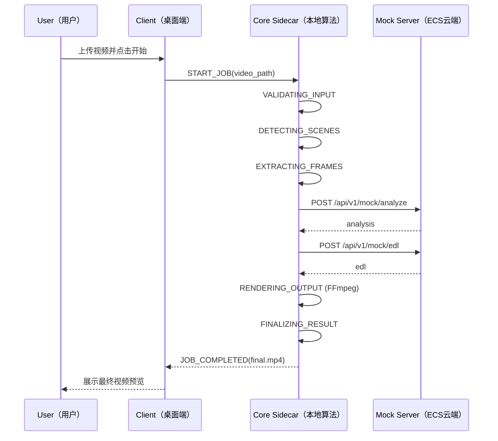
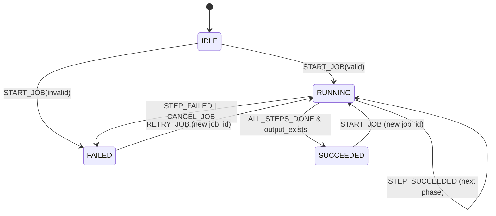

# T1 统一流程与状态机最终方案（Unified Final）

## 1. 背景与输入

本最终方案目标是形成一套可直接执行的 `T1（统一流程与状态机）` 规范，用于支撑当前 `MVP（最小可用产品）` 先跑通整链路。

## 2. 最终决策（先给结论）

### 2.1 状态机权威源

采用 `Core-Authoritative（Core 权威） + Client-Projected（Client 投影）`：

1. `Core Orchestrator（核心编排器）` 是任务状态推进的唯一权威。
2. `Client（客户端）` 负责状态展示与本地 `SQLite（本地数据库）` 持久化镜像。
3. `Server（云端）` 保持无状态请求处理，不持有全局任务状态。

选择理由：

1. 执行动作都发生在 `Core`，由其驱动状态最符合 `Single Source of Truth（单一事实源）`。
2. `Client` 仍保留恢复能力与 UI 体验，不与 `Core` 发生状态竞争。
3. `Server` 无状态更利于阿里云 `ECS（云服务器）` 部署扩缩容。

### 2.2 一级状态数量

采用 4 个一级状态：

1. `IDLE`
2. `RUNNING`
3. `SUCCEEDED`
4. `FAILED`

说明：

1. 不单独保留 `PREPARING` 一级状态，合并为 `RUNNING` 内的第一子阶段 `VALIDATING_INPUT`。
2. 用户取消归并到 `FAILED`，错误码 `RUN_CANCELLED_BY_USER`。

### 2.3 运行子阶段

`RUNNING` 内固定 7 个 `Phase（阶段）`：

1. `VALIDATING_INPUT`
2. `DETECTING_SCENES`
3. `EXTRACTING_FRAMES`
4. `ANALYZING_MOCK`
5. `GENERATING_EDL`
6. `RENDERING_OUTPUT`
7. `FINALIZING_RESULT`

其中 `Client UI（客户端界面）` 可映射展示为：

1. `detecting`
2. `extracting`
3. `analyzing`
4. `rendering`

## 3. 统一端到端流程（Final Workflow）



## 4. 统一状态机（Final State Machine）



## 5. 职责边界（最终口径）

### 5.1 Client（客户端）

1. 发起 `START_JOB / RETRY_JOB / CANCEL_JOB`。
2. 展示任务状态、阶段进度、错误信息。
3. 持久化状态镜像到 `SQLite`（仅镜像，不是状态权威）。
4. 展示关键帧与 `final.mp4` 预览。

### 5.2 Core（本地算法与编排）

1. 生成 `job_id` 并驱动全局状态机。
2. 执行切分、抽帧、渲染。
3. 调用云端 `Mock API` 并处理响应。
4. 统一上报 `progress`、`phase`、`error`。

### 5.3 Server（云端占位服务）

1. 提供 `Mock Analyze/EDL API` 与 `/health`。
2. 保持无状态；请求级内部状态可有，但不保存全局 `job state`。
3. 返回统一错误结构与 `request_id` 追踪字段。

## 6. 最小契约（Minimum Contract，非完美优先）

本阶段明确采用 `Minimum Contract（最小契约）`，不追求一次完美：

1. 只定义跑通链路所需字段。
2. 通过 `contract_version` 支持后续迭代。
3. 允许新增字段，不允许随意破坏已有必填字段语义。

### 6.1 `POST /api/v1/mock/analyze`

Request 最小字段：

1. `job_id`
2. `video_path`
3. `contract_version`
4. `frames[]`（每项至少 `timestamp`, `file_path`）

Response 最小字段：

1. `contract_version`
2. `job_id`
3. `request_id`
4. `analysis.segments[]`（每项至少 `start_time`, `end_time`, `tags[]`）

### 6.2 `POST /api/v1/mock/edl`

Request 最小字段：

1. `job_id`
2. `contract_version`
3. `segments[]`
4. `rule`

Response 最小字段：

1. `contract_version`
2. `job_id`
3. `request_id`
4. `edl.clips[]`（每项至少 `src`, `start`, `end`）
5. `edl.output_name`

### 6.3 请求头最小规范

1. `Content-Type: application/json`
2. `X-Contract-Version: 0.1.0-mock`
3. `X-Request-ID: <uuid>`（可选，Core 传入则 Server 透传）

## 7. 错误语义统一

错误分类固定为 3 类：

1. `validation_error`
2. `runtime_error`
3. `external_error`

### 7.1 标准错误响应

```json
{
  "error": {
    "type": "validation_error|runtime_error|external_error",
    "code": "VAL_VIDEO_NOT_FOUND|RUN_RENDER_FAILED|EXT_MOCK_TIMEOUT",
    "message": "readable message",
    "details": {},
    "request_id": "uuid",
    "timestamp": "ISO8601"
  }
}
```

### 7.2 错误码最小清单（T1）

1. `VAL_VIDEO_NOT_FOUND`
2. `VAL_VIDEO_FORMAT_UNSUPPORTED`
3. `VAL_EMPTY_INPUT`
4. `VAL_MISSING_REQUIRED_FIELD`
5. `VAL_CONTRACT_VERSION_MISMATCH`
6. `RUN_SCENE_DETECT_FAILED`
7. `RUN_FRAME_EXTRACT_FAILED`
8. `RUN_RENDER_FAILED`
9. `RUN_CANCELLED_BY_USER`
10. `RUN_MOCK_DATA_GENERATION_FAILED`
11. `EXT_MOCK_TIMEOUT`
12. `EXT_MOCK_UNAVAILABLE`
13. `EXT_MOCK_BAD_RESPONSE`

## 8. 可观测性与追踪

### 8.1 日志最小字段

1. `timestamp`
2. `level`
3. `job_id`
4. `request_id`
5. `job_state`
6. `running_phase`
7. `event`
8. `duration_ms`
9. `error_code`

### 8.2 追踪链路

`Client -> Core -> Server -> Core -> Client` 全链路统一使用：

1. `job_id`（任务维度）
2. `request_id`（请求维度）

## 9. 数据与并发策略（T1简化）

1. 默认 `single active job`，避免并发调度复杂度。
2. 重试永远创建新 `job_id`，不复用旧任务。
3. 相同视频重复提交按新任务处理，不做去重。

## 10. 阿里云部署口径（Server）

1. `Mock Server` 部署于 `ECS`，支持公网访问。
2. 推荐 `Docker + restart policy` 保证自恢复。
3. 暴露 `GET /health` 作为探针。
4. 可选 `Nginx` 反向代理，统一超时与 `X-Request-ID` 透传。

## 11. T1 验收标准（Final DoD）

### 11.1 功能验收

1. 用户可在桌面端完成上传并启动处理。
2. 全流程可完成：切分 -> 抽帧 -> mock分析 -> mock edl -> 拼接 -> 预览。
3. 最终输出视频存在且可播放。

### 11.2 状态机验收

1. 成功路径：`IDLE -> RUNNING(7 phases) -> SUCCEEDED`。
2. 失败路径：任一阶段失败进入 `FAILED`，且有可枚举 `error.code`。
3. `Client` 能实时展示阶段和进度。

### 11.3 可观测性验收

1. 任意任务可用 `job_id` 串联全链路日志。
2. 任意请求可用 `request_id` 在 Server 侧定位。
3. 界面错误展示能映射到 `error.type + error.code`。

## 12. 本次分歧处理记录（决策留痕）

1. 关于“状态由谁维护”：
   最终采用 `Core 权威`，`Client` 做持久化镜像。
2. 关于“是否保留 PREPARING 一级状态”：
   不保留，统一并入 `RUNNING/VALIDATING_INPUT`。
3. 关于“Mock Contract 是否一次定型”：
   不一次定型，采用 `Minimum Contract + contract_version` 迭代。

---

文档标识：`T1_unified_workflow_state_machine_final`  
适用阶段：`MVP（先跑通链路）`
